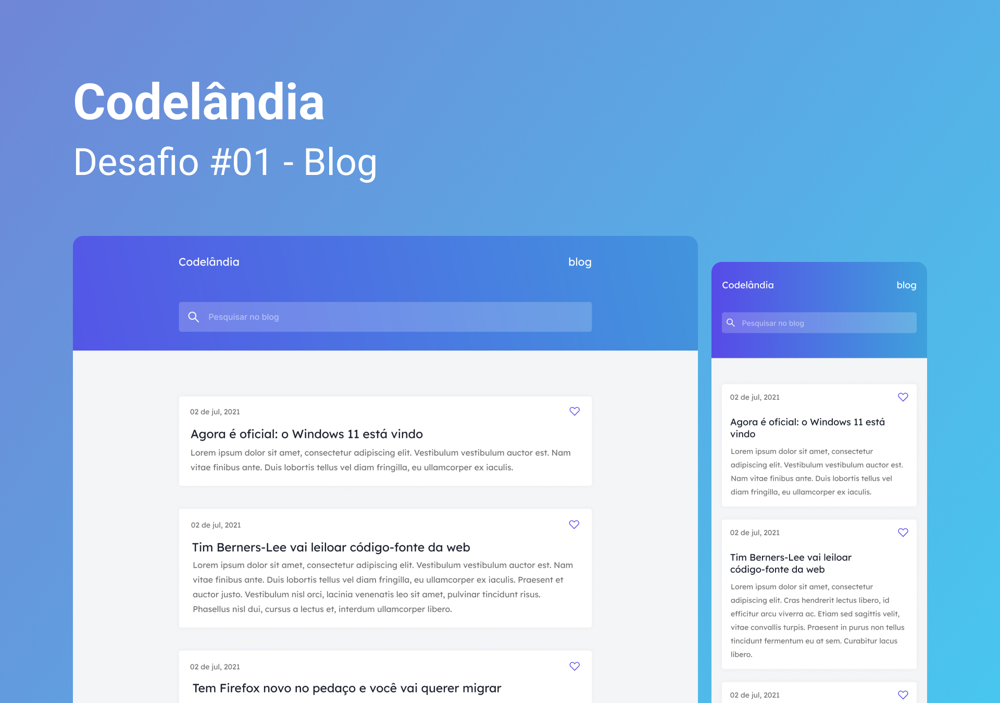

<h1 align="center"> Desafio 1 - Blog </h1>

**PT-BR:** Um projeto simples simulando um blog pessoal com artigos de tecnologia.

**EN:** A simple project simulating a personal blog with technology articles. 

  <a href="#gear-tecnologias">Tecnologias</a>&nbsp;&nbsp;&nbsp;|&nbsp;&nbsp;&nbsp;
  <a href="#writing_hand-aprendizados">Aprendizados</a>&nbsp;&nbsp;&nbsp;|&nbsp;&nbsp;&nbsp;
  <a href="#memo-licença">Licença</a>

  

  

## :gear: Tecnologias

- Figma
- HTML
- CSS

## :writing_hand: Aprendizados

Sendo o primeiro desafio que resolvi da Codelândia fiquei feliz e surpreso por ter conseguido terminar em alguns horas.
Com esse projeto comecei a entender mais sobre position, display, variáveis CSS e medias queries, além de aprender a estruturar melhor o HTML.

**Ideias de funcionalidades:**

- [ ] Filtrar os artigos pela barra de pesquisa

## :memo: Licença

Esse projeto está sob a licença MIT.
