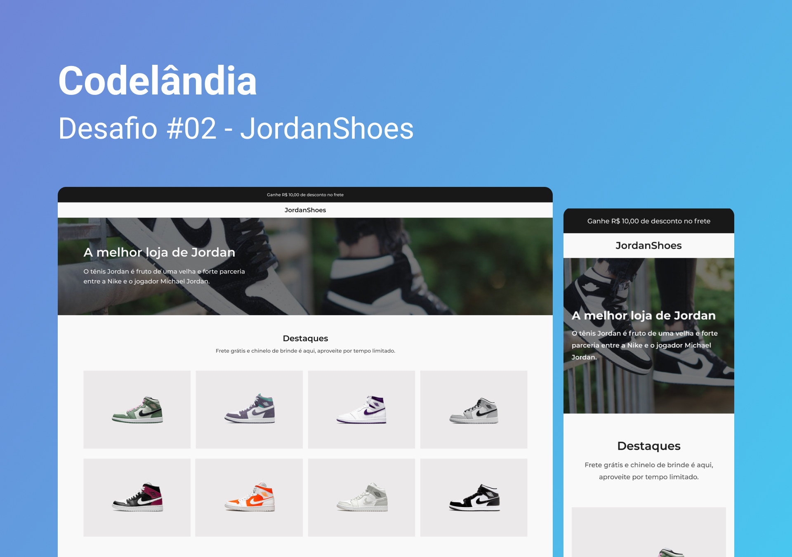

<h1 align="center"> Desafio 2 - JordanShoes </h1>

  <b>PT-BR:</b> O projeto é uma exposição simples dos produtos que existem em uma loja de tênis. 

  <b>EN:</b> The project is a simple display of the products that exist in a tennis store. 

  <a href="#gear-tecnologias">Tecnologias</a>&nbsp;&nbsp;&nbsp;|&nbsp;&nbsp;&nbsp;
  <a href="#writing_hand-aprendizados">Aprendizados</a>&nbsp;&nbsp;&nbsp;|&nbsp;&nbsp;&nbsp;
  <a href="#memo-licença">Licença</a>

  

  

## :gear: Tecnologias

- Figma
- HTML
- CSS

## :writing_hand: Aprendizados

Neste projeto tive a oportunidade de trabalhar com várias propriedades do flexbox. Pude trabalhar com posicionamentos de textos e imagens pois existem textos à esquerda e textos centralizados no site. Também aprimorei meus conhecimentos em estrutura do HTML.
Contudo tive muitas dificuldades quando precisei trabalhar o texto sobre uma imagem, e assim foi refeito várias vezes tendo diversas ideias, até que encontrei a solução mudando o contexto da posição dos elementos.

**Ideias de funcionalidades:**

- [ ] Animar quando passar o mouse por cima do produto

## :memo: Licença

Esse projeto está sob a licença MIT.
