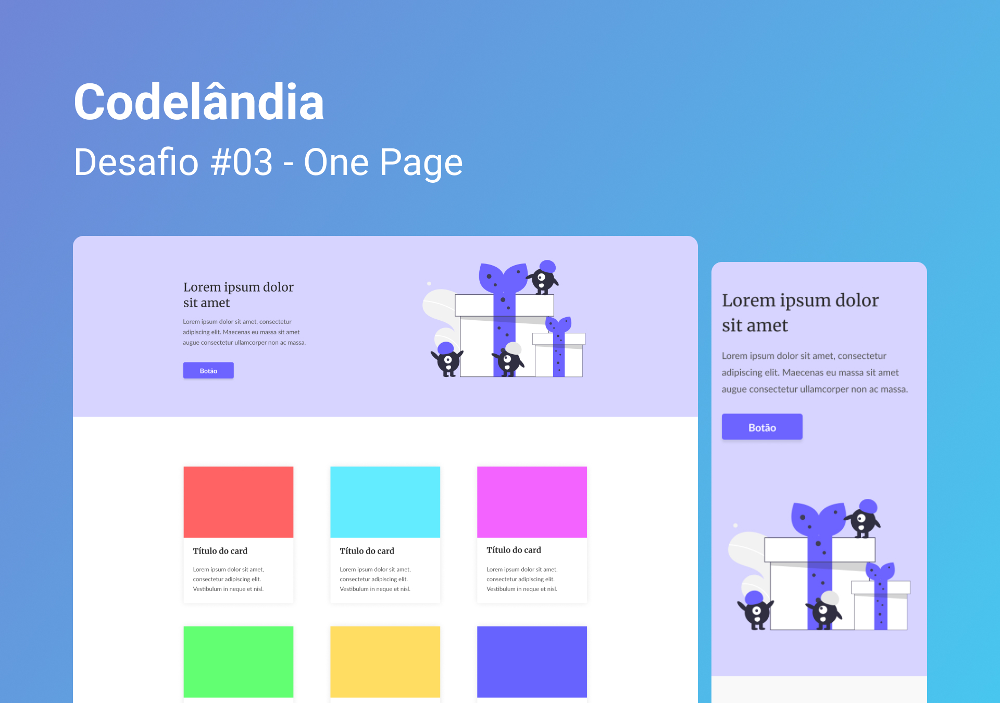

<h1 align="center"> Desafio 3 - One Page </h1>

  <b>PT-BR:</b> Projeto de página única com cartões de informações. 

  <b>EN:</b> Single page design with information cards. 

  <a href="#gear-tecnologias">Tecnologias</a>&nbsp;&nbsp;&nbsp;|&nbsp;&nbsp;&nbsp;
  <a href="#writing_hand-aprendizados">Aprendizados</a>&nbsp;&nbsp;&nbsp;|&nbsp;&nbsp;&nbsp;
  <a href="#memo-licença">Licença</a>

  

  

## :gear: Tecnologias

- Figma
- HTML
- CSS

## :writing_hand: Aprendizados

O design e a criação do projeto foram simples e até criei o favicon. Continuei usando Flexbox CSS, estruturei o HTML para facilitar a leitura do código e trabalhar com os conceitos de `width`, ainda assim demorei para tornar os elementos responsivos.

Percebi que tive dificuldades em fazer os cartões responsivos e senti a necessidade de revisar as propriedades `flex-grow`, `flex-basis` e `flex-shrink`, para facilitar a criação dos próximos projetos.

**Ideias de funcionalidades:**

- [ ] Salvar os dados do formulário com JavaScript

## :memo: Licença

Esse projeto está sob a licença MIT.
